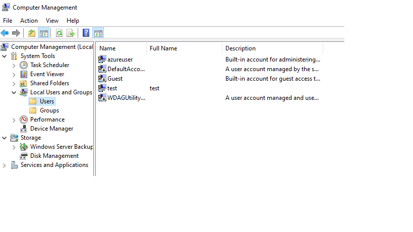

## Table of contents
1. [What is Remote Administration](#what-is-remote-administration)
2. [Types of Connections](#types-of-connections)   
   1. [Server Connections](#server-connections)
   2. [Non-Server Connections](#non-server-connections)
3. [Basic Terminology](#basic-requirements)
4. [Environment](#environment)
5. [Basic Requirement](#basic-requirements)
6. [Type of Users](#types-of-users)
7. [Enabling Remote Connections](#enabling-remote-connections)
8. [Scenarios](#scenarios)
   1. [Connect to Application](#connect-to-an-application)
   2. [Connect to Site](#connect-to-a-site)
   3. [Connect to Server](#connect-to-a-server)
9. [Extra](#extra)
10. [Key Takeaways](#key-takeaways)
11. [Resources](#resources)


## What is Remote Administration?
IIS Remote Administration is a modules that comes with IIS that enables us to allow remote connections to our IIS Server. In doing so, a user from another computer could potentially connect to the IIS Server and manage it.

I believe that prior to IIS 7.0, IIS did not come with this module and you had to download it.However, IIS now comes with this module and we only need to activate it through Server Manager.

I am referring to this: [Legacy IIS Manager for Remote Administration 1.2](https://www.microsoft.com/en-us/download/details.aspx?id=41177)

I would only have to assume that you are using the newest version or close to it. So, you DO NOT NEED above link given that IIS already has this module, you just have to enable it.

## Types Of Connections
Hopefully you know IIS well enough to know that you can create Sites and Applications. 

Microsoft's documenation says nothing regarding types of connections, but I have come to deduced that there are two types of connections for remote management. Or at least this is what it makes sense to me.

I have divided the types of connections in what I call 
1. Server connections.
2. Non-server connections.

### Server Connections
When you connect to IIS server as a whole!
With this type of connection you have access to ALL sites and applications within the server.

There is a catch though...

**In order for this to work you will have to connect with an admin user account**. Otherwise, it will fail.

Understandable, given that you are granting access to whole IIS server, it makes sense only Administrator group should be able to access.

### Non-Server Connections

With this type of connections you can connect with a Windows account/domain or with a IIS Manager account (we will see them later on).

Here again, I divided into two categories:

1. **Sites**: when you connect to an specific site.
2. **Applications**: when you connect to an speficific application.

## Basic Terminology
Again, this is not Microsoft's terminology.
But I think is best if we are going to understand each other.
* **Target Computer**: the IIS server to which you want clients to connect **TO**.
* **Client Computer**: the computer **FROM** you want to connect to the target computer.

## Environment
I have created two Azure VM's both Windows Server 2019:
* MyTargetVM
* MyClientVM

So, "MyTargetVM" is where I will have IIS Server with all my sites and applications.

"MyClientVM" is the machine that I will use to remotely administer my IIS located in "MyTargetVM"/

## Basic Requirements

### Target VM
Default IIS installation through Server Manager + "Management Service" module.  


With Powershell it would be the following command:

```PS
 Install-WindowsFeature -name Web-Server,Web-Mgmt-Service -IncludeManagementTools
```

### Client VM
IIS installed.
PowerShell:
```PS
Install-WindowsFeature -name Web-Server -IncludeManagementTools
```

## Types of Users
You can connect to the Target VM with three types of users. 

### Domain Users
If your Target VM is part of a domain, they you would connect To that Target VM FROM the Client VM as   
"DOMAIN\USER"  
In here, you would created your normal users in the Domain Controller.

### Computer Users
The normal accounts you can created in the computer.
Say you open Computer Management in the Target VM and you created a user.

Then, if you want to connect TO the Target VM FROM the Client VM, you should connect as:  
"TARGETCOMPUTERNAME\USER"

Users will be created in Computer Management:



### IIS Manager Users
IIS enable us to create virtual accounts for our use. These accounts only exists in IIS.
So, if you create an IIS Manager user account, you would just connect To Target VM FROM  Client VM as:  
"USER"

In order to create IIS users go to:  
IIS Manager > Server level > IIS Manager Users > create your users.


## Enabling Remote Connections
Remote connections are done with the Management Service. Our first task is to enabled it and start the service.
Go to  
IIS Manager > Server level > Management Service.

* Allow remote connections
* Use your preffer identity credentials. I will allow Windows & IIS Manager Users.

* Use the standard port of 8172.
* Use the standard SSL certificate.
* You can furthur filter which IP's addresses can connect to the Target VM. As for now, I will allow all clients.
* Save & Start the service. If you need to do further changes, you will have to stop the service and start it again.  
This will create several keys under:  
Computer\HKEY_LOCAL_MACHINE\SOFTWARE\Microsoft\WebManagement\Server


In addition to this, it will automatically create a Inbound Firewall to allow inbound traffic on port 8172, which is the default.

```
Web Management Service (HTTP Traffic-In)	Web Management Service (HTTP)	All	Yes	Allow	No	system	Any	Any	TCP	8172	Any	Any	Any	Any	Any	Any	
```

Because traffic will come in into Target VM on Port 8172, I need to create a inbound rule at Azure Portal VM > Networking.

**ABOVE RULES ARE ESSENTIAL!**
## Scenarios
For all scenarios I will be using IIS Manager users. The only way it differes is in the way you enter your credentials.

Domain => "DOMAIN\USER"  
Computer Account => "TARGETCOMPUTERNAME\USER"
IIS Manager user => "USER".

### Connect to an Application
For this scenario I have created an Application called  "myApplation" under "Default Website" in "myTargetVM".


Now, I will create a IIS Manager User called "applicationUser".


Go to your Application. In my case:  
IIS Manager > Sites > Default Web Site > myApplication > IIS Manager Users > allow access to IIS User.


**Swtiched to "MyClientVM"**  
Opened IIS Manager > Start Page > Connect to an application.    
There is no need to specify port because it know defualt is 8172. If you use different port you will need to make sure there is a inbound Firewall rule for that port + it needs to be opened at Azure VM level as well!!  


It will prompt you to trust the certificate.  

OK.  

It will ask you under what name it will save this connection.   


### Connect to a Site
I will create new Site called "NewSite".

Created a IIS Manager user called "siteUser".
Went to "newSite" and granted access to "siteUser".

Head over to "myClientVM"
IIS Manager > Start Page > Connect to a site.
Filled details.  
There is no need to specify port because it know defualt is 8172. If you use different port you will need to make sure there is a inbound Firewall rule for that port + it needs to be opened at Azure VM level as well!!  

Connected successfuly!


### Connect to a Server
For this to work you will need to access with Administrator account from the Target VM.

admin account of "myTargetVM" is "azureuser".

In "myClientVM"
IIS Manager > Start Page > Connect to a Server > Fill in details

The only thing is that credential will be in the following format
TARGETVMNAME\USER.
In my case:
myTargetVM\azureuser


## Extra
You can always enable logs to troublshoot issues:


## Key Takeaways
* Remote Management enables us to remotely administer our IIS Server.
* There are two types of connections
  * Server connections: require admin credentials
  * Non-server connections: do not admin credentials.
* Connections can be made with Windows users or IIS Manager Users.
* Windows Management Service uses default port of 8172. If you change this port you will need to create inbound rule in Firewall for customer port.
* In Azure Portal > Networking you need to allow access to standar port (8172) or custom port.
* If you use another port, when connecting you will have to specify IP:PORT.


## Resources
* [Remote Administration for IIS Manager
](https://learn.microsoft.com/en-us/iis/manage/remote-administration/remote-administration-for-iis-manager)
* [Configuring Remote Administration and Feature Delegation in IIS 7](https://learn.microsoft.com/en-us/iis/manage/remote-administration/configuring-remote-administration-and-feature-delegation-in-iis-7)
