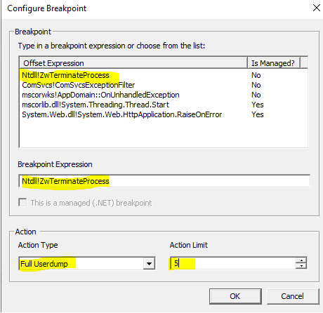
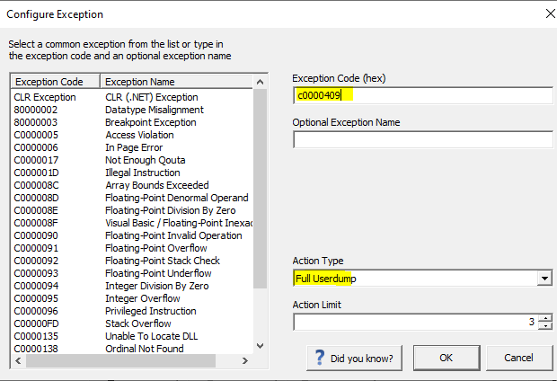
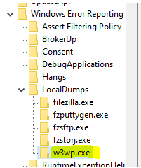

## Introduction
  
The aim of this article is to provide a quick reference guide in how to collect dumps using PROCDUMP, Debug Diag, and Windows Error Reporting (WER). However, I also find it quite useful to have an introductory section that glances over concepts such as: dumps, exceptions, debugger.
  
## Dump
  
A dump file is a snapshot that shows the process that was executing and modules that were loaded for an app at a point in time. A dump with heap information also includes a snapshot of the app's memory at that point.
  
## Info Captured By A Dump File
  
Memory dump files capture the contents of the virtual address space at one moment in time for a process that is running. That virtual address space contains almost everything that a process was using at that time to conduct its operations. Some of the most frequently used information in memory dump files is:
  
* **Heap memory**: This information includes objects or variables that are created by a process which is using statements in C++ such as "free," or "malloc" in C. Heap memory is generally used to determine what data was loaded at the time that the memory dump file was collected.
  
* **Call stacks for all threads**: These call stacks contain all the function calls that were being processed at the time that the memory dump file was collected, together with the variables that were on the stack. Call stacks are used to determine what was happening at the time that the memory dump file was collected.
      
* **Thread environment blocks**: These blocks contain information about a running thread.
      
* **Assembly code**: The assembly code that each process is executing is loaded in virtual memory. 
  
* **Module information**: Most processes use multiple files when they are executing. For example, many DLL files are frequently used to load supporting libraries for a process. A process might contain files that were created by Microsoft or by other companies. A memory dump file captures information.
      
### Types of Dumps
  
* **Full memory dump files**: These files contain the contents of virtual memory for a process. Includes all memory (Image, Mapped and Private). Includes all metadata (Process, Thread, Module, Handle, Address Space,etc).These files are the most useful when you are troubleshooting unknown issues. The disadvantage of full memory dump files is that they are large. It also may take additional time to collect these files, and the process that is being recorded must be frozen while the dump file is created.
  
* **Mini memory dump files**: A mini dump file is more configurable than a full dump file and can range from only several megabytes (MB) up to the size of a full dump file. The size differs because of the amount of virtual memory that the debugger is writing to disk. Although you can gather mini memory dump files quickly and they are small, they also have a disadvantage. Mini dump files may contain much less information than full dump files and can end up being useless. Includes directly and indirectly referenced memory (stacks and what they reference).Includes all metadata (Process, Thread, Module, Handle, Address Space, etc). 
  
In case it has not been clear enough, a dump must be taken at issue occurrence in order to yield useful information. If taken when issue is not present, it will be useless. There could be some potential scenarios where a dump will be needed when the issue is not present for comparison purposes.
  
## Debugger 
  
A debugger is a computer program used by programmers that attaches to the running application and allows developers to test and inspect the code.
The process of findings “bugs” or problems in the code is called “debugging”.
   
There are two types of Debuggers: 
  
* **Noninvasive**: minimize the debugger's interference with the target application. The debugger does not actually attach to the target application. The debugger suspends all of the target's threads and has access to the target's memory, registers, and other such information. With noninvasive debugging, you do not have as many debugging actions. However, you can minimize the debugger's interference with the target application. Cannot set breakpoints and application can resume when debugger is detached. Example of non-invasive debugger would be Windows Error Reporting (WER).
  
* **Invasive**: may interfere with the target applications, however it has more actions. Can set breakpoints and applications dies when debugger is detached. Think of this category as a spectrum, where you have debuggers that are least invasive (procdump, DebugDiag) or more invasive (Visual Studio). Meaning, not all debuggers in this category kill the application when detached. 
 
  
## Exceptions
  
An exception is an event, which occurs during the execution of a program, that disrupts the normal flow of the program's instructions. 
  
When there is no debugger attached, we only have either handle or unhandled exceptions. Meaning you (application) are actively handling what to do with these exceptions or you are not. 
  
### First Chance Exception (FCE) & Second Chance Exceptions
  
First, these exceptions only exist if a debugger is attached. Otherwise, they are either handled or unhandled exceptions.
  
1. When an application is being debugged, the debugger gets notified whenever an exception is encountered. As this is the first opportunity for the debugger to do something with the exception, this is called a FIRST CHANCE EXCEPTION.
  
2) At this point, the application is suspended, and the debugger decides how to handle the exception. The first pass through this mechanism is called a "first chance" exception.
  
3) Depending on the debugger's configuration, it will either resume the application and pass the exception onto the application to handle it, or it will leave the application suspended and enter debug mode. 
  
    3.1 If debugger does nothing with exception it passes it onto Application to handle the exception.
      
    3.2 If debugger handles the FCE, then it will do whatever it was configured to do.
  
4) Assuming exception was thrown, debugger passed exception onto Application, and Application did not handled exception either, then debugger gets re-notified of the exception. In other words, debugger gets a SECOND CHANCE to handle the exception.
  
5) Debugger now has a second opportunity to check at this exception, hence Second Chance Exception. If it decided to do something, then it will do it. If it decides to pass the exception, then it will leave debugger.
  
6) Assuming debugger did nothing with the Second Chance Exception, it will pass exception (second chance exception) onto Operating System.
  
7) If an exception ever goes to the OS, the OS will always terminate the process. Taking a dump file at a Second Chance Exception is also called “Crash dump”, because these exceptions (Second Chance Exceptions) imminently end up in a termination of the process because the OS handles exceptions by killing them.
  
## Tools
  
### PROCDUMP
  
"ProcDump is a command-line utility whose primary purpose is monitoring an application for CPU spikes and generating crash dumps during a spike that an administrator or developer can use to determine the cause of the spike. "
Installing PORCDUMP.
  
1. [Installing PROCDUMP](https://docs.microsoft.com/en-us/sysinternals/downloads/procdump)
  
2. Decompress it, open CMD and cd to its location:   
(Open as Admin)
   
  
**Most Common PROCDUMP Arguments**

   
| Parameter | Description |
|--|--|
| -ma | Write a dump file with all process memory. The default dump format only includes thread and handle information. |
| -e | Write a dump when the process encounters an unhandled exception. Include the 1 to create dump on first chance exceptions. |
| -f | Filter the first chance exceptions. Wildcards (*) are supported. To just display the names without dumping, use a blank ("") filter. |
| -m | Memory commit threshold in MB at which to create a dump. |
| -n | Number of dumps to write before exiting.  |
| -s | Consecutive seconds before dump is written (default is 10). |
| -w | Wait for the specified process to launch if it's not running. |
| -accepteula | Automatically accept the Sysinternals license agreement. |
| -c | CPU threshold above which to create a dump of the process. |
  
**PROCDUMP Commands Examples**
  
You can either use the Process ID (PID), you can get this viewing at the Task Manager, or you can use the actual process name. The only thing to take into consideration if you do decide to use the process name.
PID = ID of the process. We can see this in Task Manager.
PIDNAME = Name of the process (w3wp.exe).
  
| Command  | Description  |
|--|--|
| procdump -ma PID | Full dump of process ID. |
| procdump -ma -n 3 -s 30 PID | Three full dumps 30 seconds apart each. |
| procdump -ma -n 2 -s 2 -c 85 PID | Write one dump when PID maintains CPU above 85% for two seconds. Do this twice. |
| procdump -ma -e 1 -f "System.Net.WebException" PID | Write a full dump of PID when "Sytem.Net.Web.Exception" exception gets thrown. |
| procdump -ma -e -w PIDNAME | Wait for PIDNAME to launch, if it is not running, and take dump as soon as it encounters an unhandled exception and crashes. |
| procdump -ma -e PIDNAME | Write a Full dump for a 2nd chance exception.|
| procdump -ma -e 1 PIDNAME | Write a Full dump for a 1st or 2nd chance exception|
| procdump -ma -n 10 -e 1 -f NotFound w3wp.exe| Write up to 10 Full dumps if an exception's code/name/msg contains 'NotFound'.|
| procdump -e 1 -f "" PIDNAME | Display without writing a dump, the exception codes/names of w3wp.exe |
|procdump -ma -e 1 -f "0xc00000fd" <PID> |Write Full User Dump when specified hex code get's thrown |
  
If not given a location, they will be stored at the same location where procdump.exe is.
  
The “-w” option can useful when the process has not yet started, it will wait for the process to start.
  
### Using PROCDUMP In App Service
  
This tool is included in App Service. PROCDUMP is located at "C:\devtools\sysinternals\procdump.exe".
Go to Kudu Console.
    • https://<app-name>.scm.azurewebsites.net
Or “Azure Portal > App Service > Advanced Tools > Go”
Kudu Console:
  

  
Getting PID of the process, in this case “w3wp.exe”.
Click "Process Explorer" and identify the PID of the "w3wp.exe" that DOES NOT HAVE "scm" on its name.
  

  
Create a folder called "dumps" in "C:\home".
  
You can use “mkdir dumps”.
  
This is where our dump files will be stored.
  

  
Change directory into this “dumps/” directory.
  
Craft your command and execute it.
  
Command would look something like this:
  
```
C:\devtools\sysinternals\procdump -ma -accepteula PID 
```
  
The “accepteula” is not optional.
  
Since we already are in directory “C:\home\dumps”, files will be saved at this level.
  
However, you always have the option to run command anywhere on the system and save it in desired location.
  
```
C:\devtools\sysinternals\procdump -ma -accepteula PID C:\home\dumps
```
  
### DebugDiag(DD)
  
[Download DebugDiag](https://www.microsoft.com/en-us/download/details.aspx?id=58210)

* Note that this process can be done with any process, however, right now we are going to focus with “w3wp.exe”, which is the IIS worker process.
  
Open DebugDiag COLLECTION
  
#### **Standard Crash Rule – Second Chance Exception**
  
For this rule we are pretty much leaving all the defaults. This rule will generate up to 10 second chance exception dumps.
  
Debug Diag Collection > Add Rule > Crash > A Specific IIS Web Application Pool > [Select Application Pool Having The Issue] > Next > Next > [Define where dumps will be stored] > Next > [Activate Rule Now | Do not activate at this time] > Finish

#### **Crash Rule + Breakpoint ZwTerminateProcess**
  
With this breakpoint we are telling Debug Diag to take a dump file if functions ZwTerminateProcess() gets triggered.
  
A bit of background, a process can either crash “safely” or “unsafely”, or “graciously” or “ungraciously”. Choose your preferred terms. This function terminates a process and all of its threads. This is considered a “safe exit”, because “the proper function” got called.
  
So, this rule with this breakpoint, will collect a dump if the process got terminated by calling ZwTerminateProcess().
  
There is one small caveat to this breakpoint, it can generate false positive dumps.
If this rule is set in place, and during that time, the IIS Application Pool recycles, a dump will be generated. Why? Well, because recycling calls ZwTerminateProcess() to terminate the “w3wp.exe”.
  
Another way it could get triggered, although very rare, is if for some reason the “w3wp.exe” calls ZwTerminateProcess() ONTO ANOTHER process. This will generate a dump because ZwTerminateProcess() got call, independently if it got call to act upon “w3wp.exe” or if “w3wp.exe” called it to act onto other process”.
  
In contrast, if IIS Application Pool is indeed crashing in a “safe way” and you did not configured breakpoint in ZwTerminateProcess(), they you will have missed one opportunity to take a dump file.
  
This is up to you, there are pros and cons. Personally I prefer sticking to the standard crash rule, without breakpoint.
  
You can also get “the best of both words” by configuring Debug Diag to take up to 5 standard crash rules and up to 5 crash rules with breakpoint.
  
It will look like this:
  
Debug Diag Collection > Add Rule > Crash > A Specific IIS Web Application Pool > [Select Application Pool Having The Issue] > Next > Breakpoints > Add Breakpoint 
  
* **Breakpoint Expression**: Ntdll!ZwTerminateProcess
* **Action Type**: FULL USER DUMP
* **Action Limit**: 5
  
OK > Save & Close >Next  > [Define where dumps will be stored] > Next > [Activate Rule Now | Do not activate at this time] > Finish
  
This rule will generate up to 10 dumps. Up to 5 will be because breakpoint ZwTerminateProcess() got called and up to 5 dumps generated if worker process crashed “ungraciously”. 
  


  
* [ZwTerminateProcess](https://learn.microsoft.com/en-us/windows-hardware/drivers/ddi/ntddk/nf-ntddk-zwterminateprocess)
* [Safe Exit](https://stackoverflow.com/questions/32717582/debug-diagnostic-tool-not-generating-dumps-on-crash)

#### Specific CLR First Chance Exception
Say we need to take dump at “System.NullReferenceException”.
  
Debug Diag Collection > Add Rule > Crash > A Specific IIS Web Application Pool > [Select Application Pool Having The Issue] > Next > Exception > Add Exception > CLR Exception
  


  
* **Exception Type Equals**: System.NullReferenceException
* **Action Type**: Full Userdump
* **Action Limit**: between 3-5 is ok unless specified otherwise.
  
NOTE: We need to have the full name of the exception and we need to be sure to type it as is. For "System.NullReferenceException" (Opens in new window or tab) it lives under "System" namespace and its name is "NullReferenceException". Hence its full name is "System.NullReferenceException".
  
#### All CLR First Chance Exceptions
  
Debug Diag Collection > Add Rule > Crash > A Specific IIS Web Application Pool > [Select Application Pool Having The Issue] > Next > Exception > Add Exception > CLR Exception

* **Exception Type Equals**: Leave blank
* **Action Type**: Full Userdump
* **Action Limit**: between 3-5 is ok unless specified otherwise.

#### At Specific Exception Code
  
For exception code: 0xc0000409.
  
Debug Diag Collection > Add Rule > Crash > A Specific IIS Web Application Pool > [Select Application Pool Having The Issue] > Next > Exception > Add Exception >
  
* **Exception Code**: c0000409
* **Action Type**: Full Userdump
* **Action Limit**: 1-5
  


### High CPU
  
Not my favorite, I would say is much easier to use procdump for this purporse.

DD > Add Rule > Performance > Next > Performance Counters > Next > Add Perf Triggers > Process:%Processor Time:All > Add
  
At this point we need to identify which “w3wp.exe” corresponds to the one having the issue.
  
If you only have one, then add that one and proceed.
  

  
Performance Monitor > Add > Process: ID Process > SELECT ALL YOUR W3WP.EXE.
  

  
The field “Maximum”, among others, will match the PID of the worker process. Open Task Manager and confirm what is the PID of the worker process.
For this case the instance corresponding to PID “3036” is “w3wp#2”.
  

  
Now that we know the instance, got back to DD and use that instance
w3wp#2 > OK > Edit Thresholds > Set your desired thresholds.
  

  

  
Next > Add Dump Target > Select Application Pool having issue.
  
Set to “Collect Full UserDumps” and the quantity of number that you want.


  
Finish the as usual.
  
### Windows Error Reporting (WER)
  
The following steps describe how to configure Windows Error Reporting to capture full memory dumps of applications that crash and write the dump files to a specific directory.
  
Enabling/Disabling WER
   
```PS
#Disabling
Disable-WindowsErrorReporting
 
#Enabling
Enable-WindowsErrorReporting 
```
  
WER settings are located in one of the following registry subkeys:
   
* HKEY_CURRENT_USER\Software\Microsoft\Windows\Windows Error Reporting
* HKEY_LOCAL_MACHINE\Software\Microsoft\Windows\Windows Error Reporting
   
Above command will create a "Disabled" key with a value of "0" or "1".
  

  
Steps:
 
1. Go to:
"Computer\HKEY_LOCAL_MACHINE\SOFTWARE\Microsoft\Windows\Windows Error Reporting\LocalDumps\"
 
2. Then, create a folder with the name of the executable you are targeting. For example, "w3wp.exe":
  

  
3.Once we are on the folder, we need to create 3 keys:
  
* **DumpFolder** (:REG_EXPAND_SZ): Dump Folder will contain the information where the dump folder is:
* **DumpCount** (DWORD 32-bit): the number of dumps to be created.

* **DumpType**(DWORD 32-bit): Determines type of dump.
  * 0 = custom dump
  * 1 = mini dump
  * 2 = full user dump
    

  
4. Create a folder where the dumps will go (has to be the same location as DumpFolder file created):

5. Then right click and go to properties and then security and add IIS_IUSRS and give option to modify
 The identity of the Application Pool gets injected into “IIS_IUSRS” group.
  

  
Lastly, don't forget that you can also use Task Manager > Details and then right click process and take full userdump. This is true if issue is happening at the moment and if OS is x64 and process is x64 as well.
 
  
## Resources
* [ProcDump v11.0](https://learn.microsoft.com/en-us/sysinternals/downloads/procdump)
* [How to use ProcDump to create crash dump files on Windows 10](https://www.windowscentral.com/how-use-procdump-create-dump-files-windows-10)
* [Collect memory dumps for a first-chance exception, when it occurs](https://techcommunity.microsoft.com/t5/iis-support-blog/collect-memory-dumps-for-a-first-chance-exception-when-it-occurs/ba-p/2276128)
* [Two Minute Drill: Using PROCDUMP](https://techcommunity.microsoft.com/t5/ask-the-performance-team/two-minute-drill-using-procdump/ba-p/374124#:~:text=Using%20ProcDump%2C%20you%20can%20tell%20it%20to%20monitor,let%E2%80%99s%20take%20a%20look%20at%20the%20command%20parameters:)
* [Creating Process Dumps with ProcDump](https://kb.acronis.com/content/27931)
* [Noninvasive Debugging (User Mode)](https://learn.microsoft.com/en-us/windows-hardware/drivers/debugger/noninvasive-debugging--user-mode-)
* [What is an Exception](https://docs.oracle.com/javase/tutorial/essential/exceptions/definition.html)
* [What is a First Chance Exception?](https://learn.microsoft.com/en-us/archive/blogs/davidklinems/what-is-a-first-chance-exception)
* [Internet Information Server (IIS)](https://supportability.visualstudio.com/Developer/_wiki/wikis/Developer/185232/Internet-Information-Server-(IIS))
* [What is a "first chance exception"?](https://stackoverflow.com/questions/564681/what-is-a-first-chance-exception)
* [Memory dumps at process termination caused by second-chance exception](
https://techcommunity.microsoft.com/t5/iis-support-blog/memory-dumps-at-process-termination-caused-by-second-chance/ba-p/2235249)
* [About exceptions and capturing them with dumps](
https://techcommunity.microsoft.com/t5/iis-support-blog/about-exceptions-and-capturing-them-with-dumps/ba-p/2234600)
* [Memory dumps for hang or performance issues, "automated" approach](
https://techcommunity.microsoft.com/t5/iis-support-blog/memory-dumps-for-hang-or-performance-issues-quot-automated-quot/ba-p/2551345)
* [HTTP response 503 Service Unavailable from IIS: one common generic cause](
https://techcommunity.microsoft.com/t5/iis-support-blog/http-response-503-service-unavailable-from-iis-one-common/ba-p/1720007)
* [Memory dumps for hang or performance issues, "manual" approach](
https://techcommunity.microsoft.com/t5/iis-support-blog/memory-dumps-for-hang-or-performance-issues-quot-manual-quot/ba-p/2551283)
* [Memory dumps to study a high-CPU performance issue](
https://techcommunity.microsoft.com/t5/iis-support-blog/memory-dumps-to-study-a-high-cpu-performance-issue/ba-p/2556170)
* [Memory dumps to study a memory-leak performance issue](
https://techcommunity.microsoft.com/t5/iis-support-blog/memory-dumps-to-study-a-memory-leak-performance-issue/ba-p/2556085)
* [Memory dumps at process termination, with optional first-chance dump](
https://techcommunity.microsoft.com/t5/iis-support-blog/memory-dumps-at-process-termination-with-optional-first-chance/ba-p/2523138)
* [Memory Dump File Concepts and Processes](https://view.officeapps.live.com/op/view.aspx?src=https%3A%2F%2Fdownload.microsoft.com%2Fdownload%2Fb%2F8%2Fb%2Fb8b36faf-00f1-460f-b32b-98a20102da4e%2FMemoryDumpFileConceptsandProcesses.doc&wdOrigin=BROWSELINK)
* [Dump files in the Visual Studio debugger](https://learn.microsoft.com/en-us/visualstudio/debugger/using-dump-files?view=vs-2022)
* [Collecting User-Mode Dumps](https://learn.microsoft.com/en-us/windows/win32/wer/collecting-user-mode-dumps)
* [WindowsErrorReporting](https://learn.microsoft.com/en-us/powershell/module/windowserrorreporting/?view=windowsserver2022-ps)
* [WER Settings](https://learn.microsoft.com/en-us/windows/win32/wer/wer-settings)
* [Using Windows Error Reporting](https://supportability.visualstudio.com/Developer/_wiki/wikis/Developer/185306/Using-Windows-Error-Reporting-To-Capture-Full-Memory-Dumps)
* [Azure: KUDU Console](https://social.technet.microsoft.com/wiki/contents/articles/34931.azure-kudu-console.aspx)
* [Kudu Console](https://github.com/projectkudu/kudu/wiki/Kudu-console)
* [Kudu service overview](https://learn.microsoft.com/en-us/azure/app-service/resources-kudu)
* [ZwTerminateProcess](https://learn.microsoft.com/en-us/windows-hardware/drivers/ddi/ntddk/nf-ntddk-zwterminateprocess)
* [Safe Exit](https://stackoverflow.com/questions/32717582/debug-diagnostic-tool-not-generating-dumps-on-crash)
