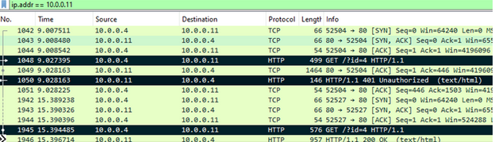
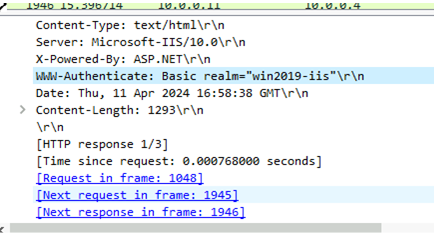
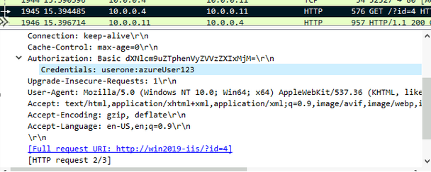
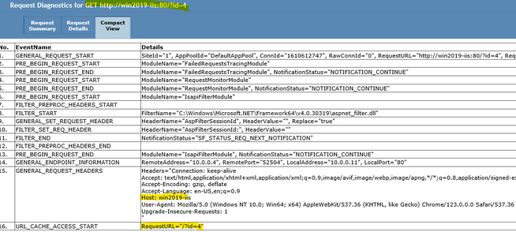
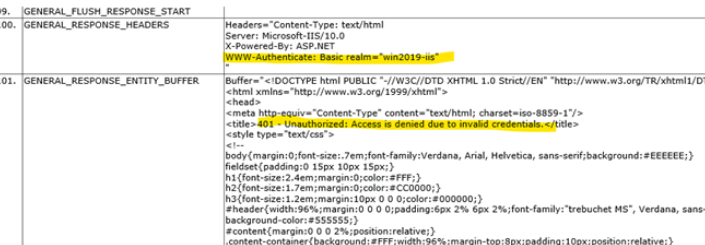
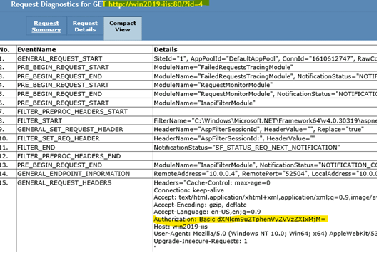

## Basic Authentication

Basic Authentication is a challenge-response authentication mechanism; where the server challenge a client to provide authentication information. Keep in mind that usernames and passwords and transmitted in cleartext (Base64) across the network with each request. Unfortunately, Basic Authentication is susceptible to attacks and does not support Multi-Factor Authentication.

During this process, a mutual secret must be established between the client and the server. The "mutual secret", in this case, is the user credentials. If the user sends its credentials, and these credentials match what the server has in its Database, we have established a mutual secret and the server has proof that you are who you say you are.

General issues with Basic authentication:

* Credentials are not encrypted.

* If the server is compromised, the attacker will have access to all stored credentials.

* Credentials are sent in every request.
 
General process:
 
1. The client sends an anonymous request to the Server. The first request is always anonymous because the client has no way of knowing that the server requires authentication.

2. The Server replies with a 401 and adds a response header with the authentication method it supports and a realm. 

Example: 

```
WWW-Authenticate: Basic realm="WallyWorld"
```

> Where "WallyWorld" is the string assigned by the server to identify the protection space of the Request-URI. A proxy may respond with the same challenge using the Proxy-Authenticate header field.

> The realm attribute (case-insensitive) is required for all authentication schemes which issue a challenge. The realm value (case-sensitive), in combination with the canonical root URL of the server being accessed, defines the protection space. These realms allow the protected resources on a server to be partitioned into a set of protection spaces, each with its own authentication scheme and/or authorization database. The realm value is a string, generally assigned by the origin server, which may have additional semantics specific to the authentication scheme.  

So, resources in the same realm should share credentials.

But in general I do not think you should pay attention to this. Just let it be...

3. This instructs the Browser to deliver a pop-up for the end user to submit their credentials.

4. The end user submits credentials.

5. The credentials are transmitted in clear text across the wire. Credentials are not encrypted, they are just Base64 encoded.

6. The Server receives the credentials and compares them with the stored credentials it has in its Database.

7. If it matches, it grants access, if not, it will send back a 401.
 
## Real-live Example:
 
In the below image, I have highlighted the three important frames of the Basic Authentication protocol.

First, we have the browser sending the anonymous request.

Then, the Server receives requests and sends back 401.

Finally, the client sends the credentials and in the very next frame the server sends back a 200 along with the requested resource.
 
 
In Wireshark, we can see the first anonymous request in frame 1048.


 
 
Let's explore each frame:

In frame 1050 the server replies with 401 add let's the user-agent know that the supported mechanism is "WWW-Authenticate: Basic".
 

 
In frame 1945, the browser sends credentials, But these **credentials are Base64 encoded!**

If you use any service to decode value, you will get credentials.

Finally, in frame 1946, the server allows access and returns an HTTP status code of 200 along with the requested resource.



That is it.

From the Server's perspective is the same story.
 
It received the first anonymous request and it sent back a 401 with Response Header " WWW-Authenticate: Basic realm="wind2019-iis"
 

 
Server response:
 

 
Then, the browser sends the correct credentials, the server compares credentials to what it has and, if they match, it will allow access. 
 

 

The Server log (IIS), shows the expected:
 
```
#Fields: date time s-ip cs-method cs-uri-stem cs-uri-query s-port cs-username c-ip cs(User-Agent) cs(Referer) sc-status sc-substatus sc-win32-status time-taken
 
# ANONYMOUS REQUEST WHICH SERVER REPLIED WITH 401

2024-04-11 16:58:38 10.0.0.11 GET / id=4 80 *-* 10.0.0.4 Mozilla/5.0+(Windows+NT+10.0;+Win64;+x64)+AppleWebKit/537.36+(KHTML,+like+Gecko)+Chrome/123.0.0.0+Safari/537.36+Edg/123.0.0.0 - *401* 2 5 2

# BROWSER SENT CORRECT CREDENTIAL AND WE CAN SEE "USERONE"

2024-04-11 16:58:44 10.0.0.11 GET / id=4 80 *userone* 10.0.0.4 Mozilla/5.0+(Windows+NT+10.0;+Win64;+x64)+AppleWebKit/537.36+(KHTML,+like+Gecko)+Chrome/123.0.0.0+Safari/537.36+Edg/123.0.0.0 - *200* 0 0 23
 
```
 
## In Summary
 
* Basic Authentication passes credentials in plaintext (Base64 encoded).

* At the very minimum, Basic Authentication should be paired with TLS. Although it would be best to opt for another type of authentication.

* The first request the client makes is anonymous.

* The credentials are sent with every request.
 
 
## Resources
* [rfc2617](https://www.ietf.org/rfc/rfc2617.txt)

* [Basic Authentication](https://learn.microsoft.com/en-us/iis/configuration/system.webserver/security/authentication/basicauthentication)

* [Basic Authentication in ASP.NET Web API](https://learn.microsoft.com/en-us/aspnet/web-api/overview/security/basic-authentication)


