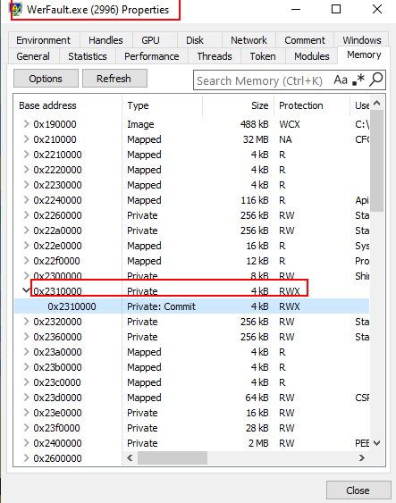

## What Is Process Injection?

* It is the process of injecting code into the memory space of another process. Think of opening a legitimate process and somehow tha attacker managed to inject some arbitrary code inside your  process as if it was part of that legitimate program in the first place.
* The code that runs inside of the legitimate process has all of the attributes and metadata of that process.


## Basic Process

1. Open the process handle for the process in which code is going to be injected.
2. Reserve and modify permissions for a region of memory within that process. This is where the code is going to be written into.
3. Write the data to an area of memory in a specified process. The "data" here being the payload.
4. Create the thread that is going to execute that code.

* Windows' APIs:
    * OpenProcess
    * VirtualAllocEx
    * WriteProcessMemory
    * CreateRemoteThread


## Drilling Down Into Each API Call
### OpenProcess

* In Windows, processes are isolated for security. To interact with another process (e.g., inject code), you must first obtain a handle to it using APIs like OpenProcess(). A handle is a process-specific reference (like a key) that the OS validates before allowing operations (e.g., WriteProcessMemory). Without a handle, direct manipulation is impossible.
* This function returns an open handle to the specified process, else returns NULL.
* This is the **syntax for OpenProcess**:

```
HANDLE OpenProcess(
  [in] DWORD dwDesiredAccess,
  [in] BOOL  bInheritHandle,
  [in] DWORD dwProcessId
);
```

* Taking a closer look at the instructions we can see that :
    * **DesiredAccess**: 0x1fffff. Sets maximum access rights.
    * **ProcessID**: the PID of the process is loaded into register "eax" and push onto OpenProcess function. This is the process in which you will inject the code into.


### VirtualAllocEx
* Definition:

```
LPVOID VirtualAllocEx(
  [in]           HANDLE hProcess,
  [in, optional] LPVOID lpAddress,
  [in]           SIZE_T dwSize,
  [in]           DWORD  flAllocationType,
  [in]           DWORD  flProtect
);
```

* This function returns the base address of the allocated region of pages.

* Where:
    * **hProcess**: the open handle OpenProcess returned.
    * **dwSize**: size of the region of memory to allocate, in bytes. It is allocating 325 bytes for the code what will be injected into this process.
    * **AllocationType**: Type of memory allocation. A value of "0x3000" ends up being "MEM_COMMIT" + "MEM_RESERVE".
    * **flProtect**: sets the memory protection for the region of pages to be allocated. The value of "0x40" is "PAGE_EXECUTE_READWRITE".


### WriteProcessMemory

* Definition:

```
BOOL WriteProcessMemory(
  [in]  HANDLE  hProcess,
  [in]  LPVOID  lpBaseAddress,
  [in]  LPCVOID lpBuffer,
  [in]  SIZE_T  nSize,
  [out] SIZE_T  *lpNumberOfBytesWritten
);
```

* Where:
    * **hProcess**: the open handle for the process.
    * **lpBuffer**: this is a pointer that actually contains the code that you want to write into the process.
    * **nSize**: the number of bytes to be written to the specifdied process. So, 325 bytes worth of data is what is going to be written into the process.


* Up to this point we have:
    * Opened a handle to a process with full access rights. 
    * Within the memory space of this process we have reserved and allocated 325 bytes  with executable permissions.
    * Finally, we are writing 325 bytes worth of data into the virtual memory space of this  process.

* The last piece of this pattern is to actually create a thread to run this code.

### CreateRemoteThread

* Definition:

```
HANDLE CreateRemoteThread(
  [in]  HANDLE                 hProcess,
  [in]  LPSECURITY_ATTRIBUTES  lpThreadAttributes,
  [in]  SIZE_T                 dwStackSize,
  [in]  LPTHREAD_START_ROUTINE lpStartAddress,
  [in]  LPVOID                 lpParameter,
  [in]  DWORD                  dwCreationFlags,
  [out] LPDWORD                lpThreadId
);
```
* Where:
    * **hProcess**: The process' handle loaded into register "edi".
    * **lpStartAddress**: Represents the starting address of the thread in the remote process. This is the result of calling "VirtualAllocEx", the returned value was stored into "eax" and then moved into "esi".


## How Does This Look?
* This malware sample was obtained from [malware.stage0.exe.malz](https://github.com/HuskyHacks/PMAT-labs/tree/main/labs/2-1.AdvancedStaticAnalysis/Malware.stage0.exe.malz)

* The way this malware works is that  it will inject some arbitrary code within the space of "WerFault.exe", this is a legitimate Windows process used for error reporting.
    * Technically, it has some interesting details on how this is achieve, but those do not matter for us right now.
* It gets the handle for this process, reserve some area of memory within the space of the process and then it injects the shellcode inside the memory space of "WerFault.exe".
* If we take a look and the memory of "WerFault.exe", we can see one section inside its memory space that has **R**ead, **W**rite and **E**xecute permissions. Highly suspicious.
* Drilling down inside this section we can see the actual shellcode that was injected and now lives inside the "WerFault.exe".



* If we extract those bytes and save them into a file and then use "scdbg.exe" to analyze the shellcode:
    * Notice the size of the payload is 325 bytes. Matching what we saw during the APIs calls.
    * This shellcode is opening a socket to "127.0.0.1:8443". In a real world scenario this would be the IP Address of the attacker. The idea is to establish a reverse shell where the attacker is listening on port 8443.
    * As soon as this malware is executed, it will open a TCP socket to an IP Address on port 8443.


## Resources
* [OpenProcess](https://learn.microsoft.com/en-us/windows/win32/api/processthreadsapi/nf-processthreadsapi-openprocess)
* [VirtualAllocEx](https://learn.microsoft.com/en-us/windows/win32/api/memoryapi/nf-memoryapi-virtualallocex)
* [WriteProcessMemory](https://learn.microsoft.com/en-us/windows/win32/api/memoryapi/nf-memoryapi-writeprocessmemory)
* [CreateRemoteThread](https://learn.microsoft.com/en-us/windows/win32/api/processthreadsapi/nf-processthreadsapi-createremotethread)
* [Process Security and Access Rights](https://learn.microsoft.com/en-us/windows/win32/procthread/process-security-and-access-rights)
* [Memory Protection Constants](https://learn.microsoft.com/en-us/windows/win32/Memory/memory-protection-constants)
* [Malware.stage0.exe.malz](https://github.com/HuskyHacks/PMAT-labs/tree/main/labs/2-1.AdvancedStaticAnalysis/Malware.stage0.exe.malz)