## Windows Registry
It is a hierarchical configuration Database that stores system, users, apps, and hardware information.

Let’s say you are a bookstore owner and you need a place to store all the relevant information about your business and how to run it. 
You buy a file cabinet and in here, you keep information like:
* Operational expenses and how to pay them.
* Employee information.
* Employee’s preferences.
* Color code of the bookstore.
* How to handle new books.
* Physical location of each genre within the store.
* Customer information.
* etc.

There may even be information that employees need at hand and can’t go to the back of the store and open the file cabinet. So you end up duplicating, in our example, some information in the cabinet and give it to the employees for easy access.

The Windows Registry is just that. In here the system stores information like:
* Computer name.
* Users information.
* User 's preferences.
* Time zone.
* Recently opened applications.
* Programs to run at start up.
* Hardware details.
* File associations. What program to use for a given file extension.

## Registry Structure

Think of a big tree where each node is called a “key” and each node can further have “child keys” called “subkey” and inside these keys or subkeys is where the information is being stored  as “entries” or “values”. The top level nodes are called “root keys” or subtree. Here is a formal definition of each component.
* **Subtree**: These are the root, or primary divisions, of the registry. There are 5 subtrees.
* **Key**: Keys are the next level down from subtree, which contain at least one subkey
* **Subkey**: Subkeys are the next level down from keys or subtrees. Subkeys store entries and other subkeys.
* **Entry**: These are the lowest-level elements in the registry. Each entry consists of the entry name, its data type, and a field known as the value of the registry entry. Data is stored in the value. 
* **Hive**: a logical group of keys, subkeys, and values in the registry that has a set of supporting files loaded into memory when the operating system is started or a user logs in.
* **Hive files**: The permanent parts of the registry are stored as a set of files called the hive files

We will take a look at “hive” and “hive files” later on.

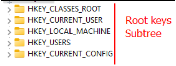

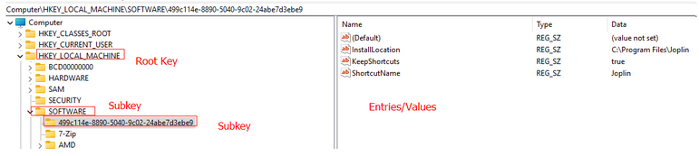

## Subtree (Root Keys)

* HKEY_CLASSES_ROOT (HKCR)
  * It is a combination of user settings and system settings.
  * File type associations. 
  * Derived from HKCU/Sofware/Classes + HKLM/Sofware/Classes
* HKEY_CURRENT_USER (HKCU)
  * Stores information about the user who is currently logged on.
  * It is a pointer to HKU/<SID>
* HKEY_LOCAL_MACHINE (HKLM)
  * Stores information particular to the system.
* HKEY_USERS (HKU)
  * Stores information about all users that have a profile created on the system.
* HKEY_CURRENT_CONFIG (HKCC)
  * Stores information about hardware profiles used by the local computer at startup.
  * Pointer to HKLM\SYSTEM\CurrentControlSet\Hardware Profiles\Current

## Registry Value Types (Most Common)

As we know, we can create entries/values for each key. These entries also have a data type associated with it.

Here are some of the most common data types:

| Value         | Type                                                          |
| ------------- | ------------------------------------------------------------- |
| REG_BINARY    | Binary data.                                                  |
| REG_DWORD     | A 32-bit number.                                              |
| REG_EXPAND_SZ | An expandable string. It can contain environmental variables. |
| REG_MULTI_SZ  | A multi string value                                          |
| REG_QWORD     | A 64-bit number.                                              |
| REG_SZ        | A string value.                                               |

## Registry Element Size Limit
Take into consideration the registry’s limitation:

* The “key name” can be up to 255 characters long. The key name includes the absolute path of the key in the registry.
* The “value name” can be up to 16,383 characters long.
* The value’s length depends on the data type,however, it has an overall limit of 1MB.
* A registry “tree” can be 512 levels deep.

## Registry Hives
* **Hive**: a logical group of keys, subkeys, and values in the registry that has a set of supporting files loaded into memory when the operating system is started or a user logs in.

So a “hive” has basically two conditions:
1. It has to be a group of keys, subkeys, and values.
2. It must have a set of supporting files that live on the system and loaded into memory when the OS is started.

The files containing all the information stored in the Registry must live somewhere on the system. A “hive” is a collection of keys that also has a file where there is this information and well, there may be backup files.

From documentation these are considered the registry hives:

## Hives & Supporting Files

| Registry Hive      | Supporting Files                           | Location                                                          |
| ------------------ | ------------------------------------------ | ----------------------------------------------------------------- |
| HKLM\\SAM          | Sam, Sam.log, Sam.sav                      | %SystemRoot%\\System32\\config                                    |
| HKLM\\Security     | Security, Security.log, Security.sav       | %SystemRoot%\\System32\\config                                    |
| HKLM\\Software     | Software, Software.log, Software.sav       | %SystemRoot%\\System32\\config                                    |
| HKLM\\System       | System, System.alt, System.log, System.sav | %SystemRoot%\\System32\\config                                    |
| HKU\\.DEFAULT      | Default, Default.log, Default.sav          | %SystemRoot%\\System32\\config                                    |
| HKU\\<SID>         | NTUSER.DAT                                 | %UserProfile%\\ntuser.dat                                         |
| HKU\\<SID>_Classes | UsrClass.dat                               | “%UserProfile%\\AppData\\Local\\Microsoft\\Windows\\UsrClass.dat“ |
| HKLM\\BCD          | \\Boot\\BCD                                | Boot Configuration Data. Cannot be accessed via standard methods. |

Notice that for each location, let’s take “HKLM\SAM” as an example, there is a corresponding file that stores this information at “%SystemRoot%\System32\config\SAM” and this is loaded into memory at startup.

For example if you take this path: “Computer\HKEY_LOCAL_MACHINE\SOFTWARE\ASUS” this is NOT a registry hive because, although it consist of a group of keys and subkeys, it does not directly map to a file on the system.

While  “Computer\HKEY_LOCAL_MACHINE\SOFTWARE” does directly map to “%SystemRoot%\System32\config\SOFTWARE”.

Isn’t “Computer\HKEY_CURRENT_USER” also a registry hive? I do not think it is technically a registry hive because this is an alias/pointer to “Computer\HKEY_USERS\<SID>”. 

The same is true for “Computer\HKEY_CURRENT_CONFIG” it ends up being just a pointer, so I do not think they should be considered as a registry hive.

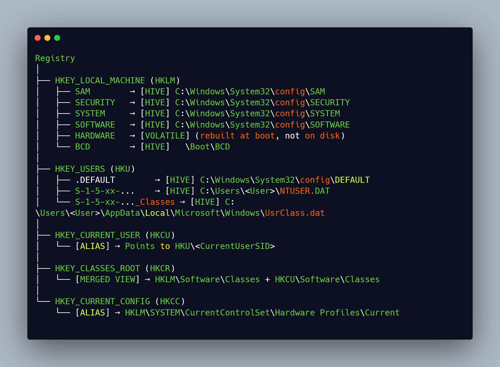

## File Extensions

The supporting files can have the following file extensions:

| Extension | Description                                                                            |
| --------- | -------------------------------------------------------------------------------------- |
| None      | A complete copy of the hive data.                                                      |
| .alt      | A backup copy of the critical HKLM\\System hive. Only the System key has an .alt file. |
| .log      | A transaction log of changes to the keys and value entries in the hive.                |
| .sav      | A backup copy of a hive.                                                               |

## Investigating Hives/Keys
### HKU
* A raw storage for all actively loaded user profiles. 
* It creates a subkey based on the SID of the users that have a profile on the system.
* For each user, that has a profile, it: 
  * Looks for “C:\Users\<username>\NTUSER.DAT” and load it into “HKU\SID”.
    * You may find desktop, control panel, environmental variables, app preferences information.
  * Looks for  “C:\Users\<username>\AppData\Local\Microsoft\Windows\UsrClass.dat” and loads it into “HKU\SID_Classes”
    * You may find COM registrations, file associations, shell extensions.

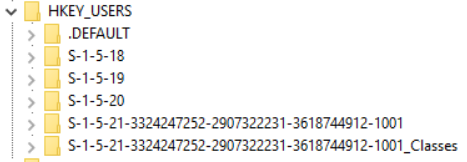

| Subkey           | Description                                                               |
| ---------------- | ------------------------------------------------------------------------- |
| HKU.DEFAULT      | Default user profile                                                      |
| HKU<SID>         | Specific user profile settings.                                           |
| HKU<SID>_Classes | User-specific COM registrations, file associations, and shell extensions. |
| HKU\\S-1-5-18    | Local System Account                                                      |
| HKU\\S-1-5-19    | Local Service Account                                                     |
| HKU\\S-1-5-20    | Network Service Account                                                   |

### HKCU

* HKCU is basically a symbolic link that points to the SID of the currently logged-in user under HKU. Here is where the information for that particular user resides.
  * HKCU => HKU\CurrentUserSID
  * HKCU\Software\Classes => HKU\CurrentUserSID_Classes

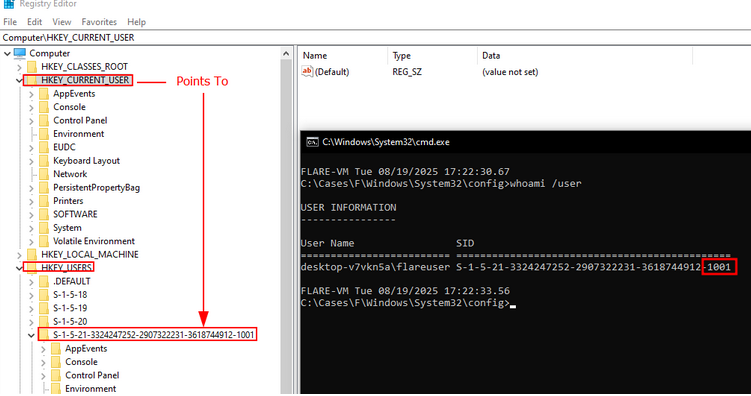

### HKLM

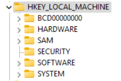

| Subkey         | Description                                                                 |
| -------------- | --------------------------------------------------------------------------- |
| HKLM\\SAM      | Local user & group accounts, password hashes.                               |
| HKLM\\SECURITY | Local Security Authority (LSA) secrets, local security policies.            |
| HKLM\\SYSTEM   | System configuration.                                                       |
| HKLM\\SOFTWARE | System-wide software and OS configuration.                                  |
| HKLM\\HARDWARE | Volatile hive, rebuilt at boot; describes hardware detected by Plug & Play. |

### HKCR
* Remember this is a combination of HKLM\Software\Classes and HKU\SID_Classes.
* Contains information about which program to use when opening a file extension.
* COM registrations.
* File type icons.

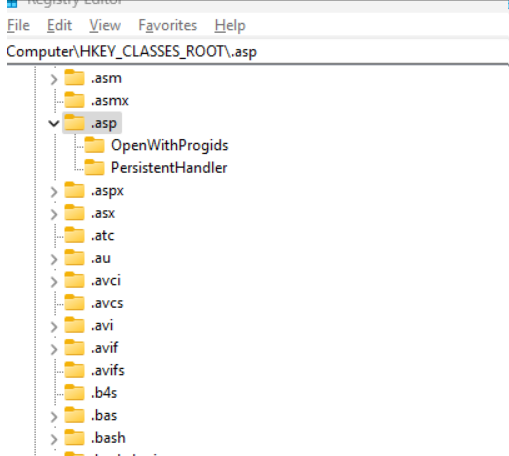

### HKCC
* It is a pointer to “HKEY_LOCAL_MACHINE\SYSTEM\CurrentControlSet\Hardware Profiles\Current”.
* Holds current hardware configuration profile.

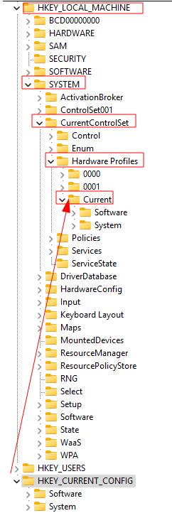

## Collecting The Registry

So, let’s say somebody asks you to collect the Windows Registry. In order for us to collect the registry data  we would need to take the HKLM files that are located at “C:\Windows\System32\config\”. Then, based on the user that we are focusing on, collect the “%UserProfile%\NTUSER.DAT” and “%UserProfile%\AppData\Local\Microsoft\Windows\UsrClass.dat“ to have a full view of the computer along with the user’s settings.

Of course there are tools that collect this automatically, but we can manually just grab these files and then use a program like "Registry Explorer" to parse them.

The only caveat is that some files/hives may be “dirty”. Notice that each hive has a corresponding “.log”, this stores pending transactions that have not been merged into the main hive file. You may need a special program to merge them or wait for Windows to do it. But then again, this is another topic.

If we were to manually collect the hive, just browse to those locations and copy the files:

“%SystemRoot%\System32\config”

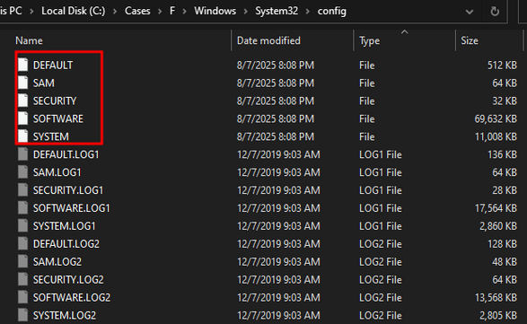

“C:\Users\<username>\NTUSER.DAT”:

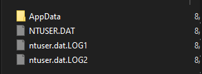

“C:\Users\<username>\AppData\Local\Microsoft\Windows\UsrClass.dat“:

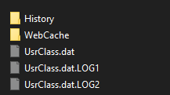

## Resources

- [Windows registry information for advanced users](https://learn.microsoft.com/en-us/troubleshoot/windows-server/performance/windows-registry-advanced-users)  
- [Structure of the registry](https://learn.microsoft.com/en-us/windows/win32/sysinfo/structure-of-the-registry)  
- [Registry value types](https://learn.microsoft.com/en-us/windows/win32/sysinfo/registry-value-types)  
- [Registry element size limits](https://learn.microsoft.com/en-us/windows/win32/sysinfo/registry-element-size-limits)  
- [Restore the registry (advanced users guide)](https://learn.microsoft.com/en-us/troubleshoot/windows-server/performance/windows-registry-advanced-users#restore-the-registry)  
- [Description of the Microsoft Windows registry (Windows Server 2003)](https://learn.microsoft.com/en-us/previous-versions/windows/it-pro/windows-server-2003/cc781906(v=ws.10))  
- [Registry hives](https://learn.microsoft.com/en-us/windows/win32/sysinfo/registry-hives?source=recommendations)  
- [Registry Explorer](https://ericzimmerman.github.io/#!index.md)
